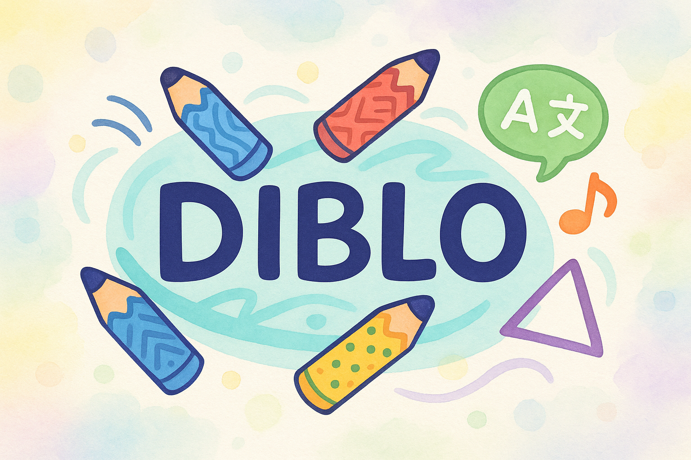

# Diblo



## 🎯 Descripción del Proyecto

Diblo es una aplicación interactiva y educativa diseñada para enriquecer la experiencia de aprendizaje de palabras a través de la combinación de dibujo, pronunciación y reconocimiento de voz. Desarrollada con el framework Kivy, esta aplicación multisensorial está orientada a usuarios de todas las edades que deseen mejorar su vocabulario y habilidades de comunicación de una manera lúdica y atractiva.

La aplicación presenta una palabra al usuario, quien debe dibujarla en un lienzo digital. Posteriormente, el usuario pronuncia la palabra y Diblo utiliza tecnología de reconocimiento de voz avanzada (online y offline) para validar si la pronunciación es correcta. Esta metodología no solo refuerza el aprendizaje visual y auditivo, sino que también estimula la creatividad y la expresión oral.

## ✨ Características Destacadas

* **Interfaz de Usuario Intuitiva (UI/UX)**: Diseño limpio, responsivo y fácil de navegar, optimizado para una experiencia de usuario fluida en diversos dispositivos.
* **Lienzo de Dibujo Interactivo**:
    * Soporte para múltiples colores seleccionables desde una paleta predefinida.
    * Funcionalidad de borrado instantáneo del lienzo con confirmación de usuario.
    * Exportación de dibujos a archivos PNG con nombres de archivo estructurados (palabra + fecha/hora).
* **Gestión de Palabras Flexible**:
    * Carga de vocabulario desde un archivo JSON configurable (`palabras.json`).
    * Organización de palabras en categorías personalizables (ej., Animales, Objetos, Naturaleza).
    * Selección aleatoria de palabras dentro de la categoría activa o de la lista por defecto.
* **Reconocimiento de Voz Robusto**:
    * **Modo Online**: Utiliza Google Speech Recognition para una alta precisión cuando hay conexión a internet.
    * **Modo Offline (Vosk)**: Permite el reconocimiento de voz sin necesidad de internet, ideal para entornos con conectividad limitada. Proporciona notificaciones claras si el modelo no está disponible.
    * **Manejo de Errores**: Feedback visual y textual para casos de micrófono no encontrado, problemas de acceso, o si el audio no es inteligible.
* **Pronunciación Asistida**:
    * Reproducción clara de la palabra a dibujar utilizando `gTTS` (Google Text-to-Speech).
    * Sistema de caché inteligente para evitar la regeneración de audio de palabras ya pronunciadas, mejorando la eficiencia.
* **Internacionalización (i18n)**:
    * Soporte nativo para múltiples idiomas en todos los textos de la interfaz (actualmente Español e Inglés).
    * Gestión centralizada de textos a través de archivos JSON en el directorio `lang/`.
* **Retroalimentación en Tiempo Real**: Indicadores visuales (texto parpadeante "Escuchando...") y sonoros (sonidos de inicio y fin de grabación) para una interacción fluida y clara.
* **Registro de Eventos (Logging)**: Implementación de un sistema de logging para facilitar la depuración, el monitoreo del rendimiento y el seguimiento de la actividad de la aplicación.

## ⚙️ Requisitos del Sistema

Para ejecutar Diblo, necesitarás:

* **Python 3.8 o superior**.
* Un **micrófono** configurado y funcional en tu sistema.
* **Espacio en disco** para los archivos del proyecto y el modelo Vosk (aprox. 40-50 MB adicionales).

Diblo ha sido probado y es compatible con sistemas operativos **Linux**, **Windows** y **macOS**.

## 🚀 Instalación y Configuración

Sigue estos pasos detallados para poner Diblo en funcionamiento en tu entorno local.

### 1. Obtener el Código Fuente

Puedes clonar el repositorio de Git o descargar la versión ZIP.

```bash
# Opción 1: Clonar el repositorio (recomendado si usas Git)
git clone [https://github.com/](https://github.com/)[TU_USUARIO]/Diblo.git
cd Diblo

# Opción 2: Descargar el ZIP
# Descarga el archivo .zip del repositorio desde GitHub, descomprímelo
# y navega hasta la carpeta principal 'Diblo' en tu terminal.